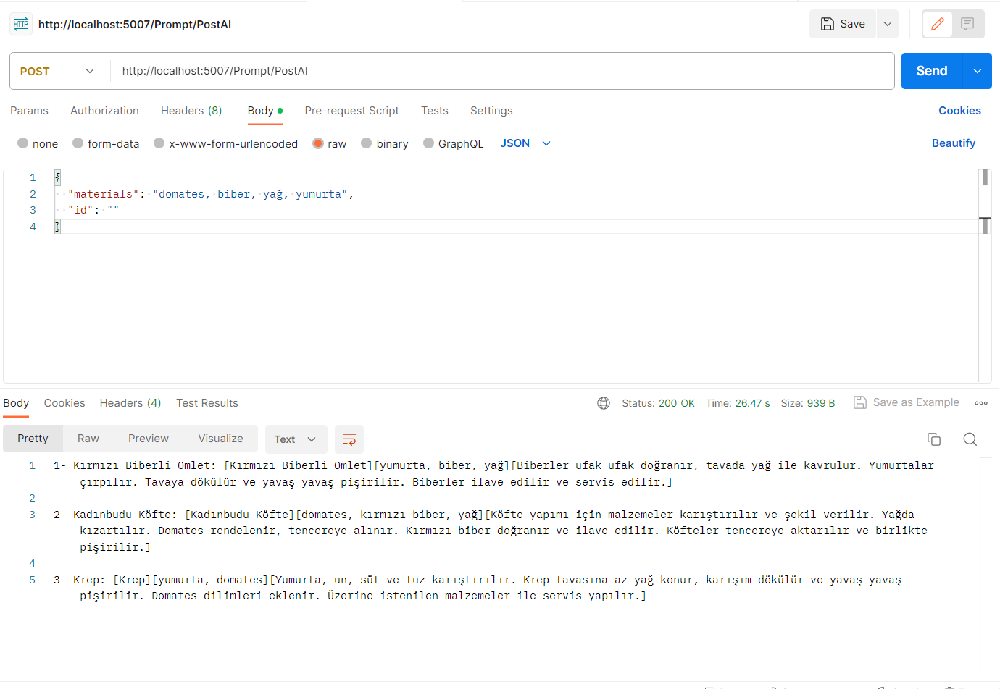

# Giriş:

Bu dökümantasyon, yapay zeka tabanlı bir backend projesini tanıtmak ve kullanıcıya ürünlere göre yemek tarifi sağlamak için kullanılan bir sistem hakkında ayrıntılı bilgi sunmak amacıyla oluşturulmuştur. Bu projenin ana amacı, kullanıcının istediği ürünleri belirleyerek, bu ürünlere uygun yemek tariflerini sunmak ve aynı zamanda günün önerilen yemeğini sunmaktır.

Bu backend projesi, bir dizi önemli bileşeni içermektedir. İlk olarak, kullanıcının ürünleri belirttiği bir arayüz sağlamaktadır. Kullanıcı, çeşitli ürünleri girebilir ve bu ürünlerin temelinde bir yemek tarifi elde etmek için projenin sağladığı API'ları kullanabilir.

Projenin temelinde yer alan yapay zeka algoritması, girdi olarak kullanıcının belirttiği ürünleri alır ve bu ürünlere dayalı olarak uygun yemek tariflerini önerir. Yapay zeka algoritması, içeriğindeki veri tabanına erişerek, geniş bir yemek tarifi veritabanını kullanır ve ürünlere en uygun yemekleri belirlemek için öğrenme ve eşleştirme yöntemlerini kullanır.

Bu projenin bir diğer önemli işlevi, günün önerilen yemeğini sunmaktır. Proje, kullanıcının coğrafi konumunu ve diğer faktörleri dikkate alarak günün önerilen yemeğini belirler ve kullanıcıya sunar. Bu, kullanıcının kolaylıkla günlük yemek planlamasını yapabilmesine yardımcı olur.

Bu dökümantasyon, projenin kurulumu, yapılandırması, API'larının kullanımı, örnek istekler ve yanıtlar, hata ayıklama yöntemleri, sınırlamalar ve bilinen sorunlar gibi konuları ayrıntılı bir şekilde ele almaktadır. Ayrıca, projenin sürüm geçmişi ve ilgili referanslar da dökümantasyonun bir parçasıdır.

Bu dökümantasyonun amacı, kullanıcılara projeyi anlamaları ve kullanmaları için gerekli bilgileri sağlamaktır. Projenin başarılı bir şekilde dağıtılması ve kullanılması için dökümantasyonun güncel ve anlaşılır tutulması önemlidir.

---

---

# Kurulum:
appsettings.json içerisindeki;

1- Application kısmındaki JWT token üretebilmesi için keyler var lütfen kendi gizli keyiniz orada oluşturun.

2- AIKeys kısmındaki OpenAIKeys kısmında OpenAI Üzerinden aldığınız kendi keyinizi kullanınız.(kodlar GPT 3.5 Turbo ile yazılmıştır. Ayrıntı için Services/AIService/OpenAIPromptServices dosyasını inceleyiniz)

3- ConnectionStrings kısmındaki DatabaseContext kısmına kendi veritabanınızı bağlayınız ve migration kullanınız.

Her kullanıcı için oluşturulan token için 5000 saniye verilmiştir. değişiklik için Services/AccessTokenGenerator içindeki GenerateToken metodunu inceleyiniz.


---

# Proje içeriği:

## Prompt
Yapay zekaya gönderilen promptlara dair işlemler buradan çekilir. 

```
/Prompt/PostAI
```
```
{
  "materials": "string",
  "id": "string"
}
```
materials => yapay zekaya gönderilecek ürünler

id => varsa kullanıcının Id'si

```
/Prompt/GetPrompt
```
```
{
  "id": int
}
```
id => promptu Id'si

```
/Prompt/GetAllPrompt
```
Daha önce atılmış bütün promptları çeker.

```
/Prompt/GetAllPromptForUser
```
```
{
  "UserId": "string"
}
```
UserId => Kullanıcının Id'sine göre bütün promptları çeker

```
/Prompt/DeletePrompt
```
```
{
  "id": "string"
}
```
id => prompt Id'sine göre silme işlemi yapar

```
/Prompt/UpdatePrompt
```
```
{
  "_materials": "string",
    "_PromptId": int
}
```
_materials => düzenlenecek materyaller
_PromptId => düzenlenecek prompt'un Id'si

UserId => kullanıcının Id'sine göre bütün promptları çeker

## AIAnswer
Yapay zekaya daha önce gönderilen promptlar ve cevaplarına dair işlemler buradan yapılır. 
```
/AIAnswer/AddAIAnswer
```
```
{
  "_promptmaterials": "string",
  "_AIAnswer": "string",
  "_UserId": "string"
}
```
_promptmaterials => gönderilen prompt materyalleri

_AIAnswer => yapay zekanın verdiği cevaplar

_UserId => kullanıcı Id'si

```
/AIAnswer/GetAIAnswer
```
```
{
  "Id": int
}
```
Id => Yapay zeka cevabının Id'si

```
/AIAnswer/GetAllAIAnswer
```
Yapay zeka cevaplarının tamamını çeker

```
/AIAnswer/GetAllAIAnswerForUser
```
```
{
 "_UserId": "string"
}
```
_UserId => Kullanıcının Id'si ile daha önce yaptığı promptlar ve cevablerını tamamını getirir

```
/AIAnswer/GetAIAnswerForPrompt
```
```
{
 "PromptId": int
}
```
PromptId => daha önce atılmış bir promptun Yapay zeka cevabını getirir

```
/AIAnswer/DeleteAIAnswer
```
```
{
 "id": int
}
```
id => Yapay zeka cevaplarının birini Id'si ile silmeni sağlar
```
/AIAnswer/UpdateAIAnswer
```
```
{
  "AIAnswerId": int,
  "promptMaterials": "string",
  "AIAnswerRecipe": "string"
}
```
AIAnswerId => Yapay zekanın cevabının Id'si
promptMaterials => daha önce atılmış prompt
AIAnswerRecipe => yapay zekanın yemek tarifi
## MealOfDay
Günün yemeği kategorisine dair işlemler buradan yapılır.

```
/MealOfDay/GetMealOfDay
```
```
{
  "Id": int
}
```
Id => Günün yemeğini Id'sine göre getirir.

```
/MealOfDay/GetAllMealOfDay
```
Bütün yemekleri getir.
```
```
/MealOfDay/AddMealOfDay
```
{
  "MealName": "string",
  "MealRecipe": "string",
  "MealPhoto": "string"
}
```
MealName => Eklenecek günün yemeğinin ismi

MealRecipe => Eklenecek günün yemeğinin tarifi

MealPhoto => Eklenecek günün yemeğinin resminin adresi

```
/MealOfDay/DeleteMealOfDay
```
```
{
  "id": int
}
```
id => Silinecek yemeğin Id'si

```
/MealOfDay/UpdateMealOfDay
```
```
{
  "mealOfDayId": int,
  "mealOfDayName": "string",
  "mealOfDayRecipe": "string",
  "mealOfDayPhoto": "string"
}
```
mealOfDayId => düzenlenecek yemeğin Id'si

mealOfDayName => düzenlenecek yemeğin ismi

mealOfDayRecipe => düzenlenecek yemeğin tarifi

mealOfDayPhoto => düzenlenecek günün yemeğinin resminin adresi
## User
Kullanıcılara dair işlemler

```
/User/Register
```
```
{
  "fullName": "string",
  "emailAddress": "user@example.com",
  "password": "string",
  "confirmPassword": "string"
}
```
fullName => Kayıt olan Kullanıcı Adı 

emailAddress => Kullanıcıdan alınacak email adresi

password => şifre

confirmPassword => şifre tekrarı

# Yapı:

Yapay Zekaya Gönderilen Promptlar:
Bu bileşen, kullanıcının yapay zekaya gönderdiği promptları yönetir. Promptlar, kullanıcının taleplerini veya sorularını içeren metin veya veri parçalarıdır. Bu bileşen, kullanıcının promptları alır, işler ve yapay zekaya iletmek için gerekli süreçleri gerçekleştirir.

Yapay Zekanın Cevapları:
Yapay zekanın cevapları bu bileşen tarafından yönetilir. Yapay zeka modeli, alınan promptlara göre bir yanıt üretir ve bu yanıtlar bu bileşen tarafından kullanıcıya iletilir. Yanıtlar, kullanıcıya sunulmadan önce gerekli formatlama ve işlemlerden geçirilir.

Kullanıcının Giriş ve Kayıt Olması:
Bu bileşen, kullanıcıların sisteme giriş yapmalarını ve kayıt olmalarını sağlar. Microsoft.Identity ve JWT (JSON Web Token) gibi kimlik doğrulama mekanizmaları kullanılarak kullanıcıların kimliklerini doğrulamak için gerekli işlemler gerçekleştirilir. Kullanıcılar, kayıt olmadan önce gerekli bilgileri sağlayarak hesaplarını oluşturabilir ve ardından giriş yapabilirler.

Günün Yemeği İşlemleri:
Bu bileşen, günün yemeği ile ilgili işlemleri yönetir. Veritabanında tutulan yemek bilgileri üzerinde ekleme, çıkarma, silme ve düzenleme gibi işlemleri gerçekleştirir. MSSQL gibi bir veritabanı kullanılarak yemek bilgileri tutulur ve bu bileşen, veritabanıyla iletişim kurarak gerekli işlemleri gerçekleştirir.

Kimlik doğrulama için Microsoft.Identity ve JWT kullanılması, kullanıcıların güvenli bir şekilde giriş yapabilmelerini sağlar ve yetkilendirme işlemlerini yönetir. Veritabanı olarak MSSQL kullanılması, yemek bilgilerinin tutulması ve yönetilmesi için güvenilir bir depolama sağlar.

Bu yapı bileşenleri bir araya gelerek backend projesinin temel işlevlerini yönetir. Her bileşen, kendi sorumluluk alanında işlemleri gerçekleştirir ve projenin genel amacına hizmet eder.

---

# Kütüphaneler

Betalgo.OpenAI (6.8.6)

Swashbuckle.AspNetCore(6.2.3)

Microsoft.AspNetCore.Authentication.JwtBearer (6.0.16)

Microsoft.AspNetCore.Identity.EntityFrameworkCore (6.0.16)

Microsoft.AspNetCore.Mvc.NewtonsoftJson (6.0.16)

Microsoft.EntityFrameworkCore (7.0.5)

Microsoft.EntityFrameworkCore.Design (7.0.5)

Microsoft.EntityFrameworkCore.SqlServer (7.0.5)

Microsoft.EntityFrameworkCore.Tools (7.0.5)
